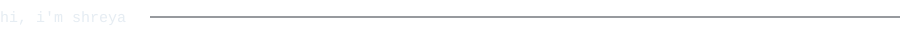
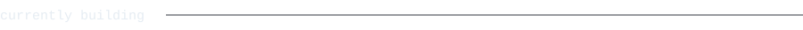
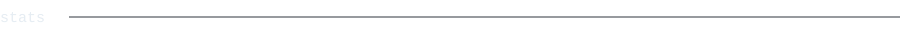
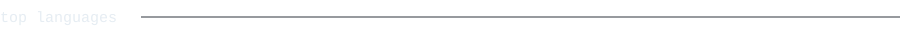

<blockquote>
B.Tech student (K. J. Somaiya School of Engineering, Somaiya Vidyavihar
University) and Flutter developer intern. I build mobile apps, dig into
ML research, and occasionally make my GitHub profile draw itself.
</blockquote>

**Project Carbon** -- a Flutter mobile app for carbon credit and waste
recycling management, built as part of my internship team.

**Deepfake detection research** -- internship research project on
detecting manipulated media.

**Project Sentinel v5.0** -- a UPI fraud / mule-account detection system
(<samp>GraphSAGE</samp>, federated learning, <samp>ZK-SNARK</samp>, escrow).
I'm building the backend and ML core.

**FoodresQ** -- a full-stack food donation / rescue web app
(<samp>React</samp> + <samp>Node</samp>/<samp>Express</samp>), aligned with SDGs 2, 12, and 17.

Portrait, stats and headings above are generated inside this repository
by a scheduled action -- no third-party widgets, nothing that can rate-limit
or go dark. Typeface: <samp>JetBrains Mono</samp>, SIL OFL 1.1.
